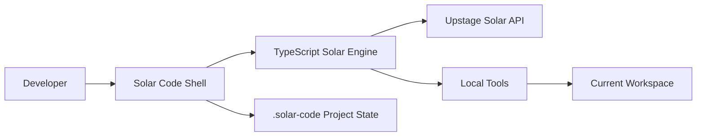

<div align="center">

# Solar Code

**A Solar-native terminal coding agent for local repositories**

Solar Code is an interactive coding agent shell powered by Upstage Solar.  
It can inspect your repository, plan code changes, edit files, run commands, and preserve project-local session history.

<br />

<a href="https://www.npmjs.com/package/solar-code">
  
</a>


</div>

---

## Overview

**Solar Code** is a local terminal coding agent designed for real repository work.

It is closer to **Claude Code** or **Codex CLI** than a collection of standalone commands.  
You launch Solar Code inside your project, talk to Solar through an interactive shell, and approve file edits or command executions when needed.

```text
solar
› Ask Solar Code to work on your code
• Thinking
• Plan write_file src/example.ts
• Modified
  Write src/example.ts
  ? approve? y yes · n no · enter deny
solar › done
```

---

## Why Solar Code?

Solar Code began as a project inspired by Anthropic's Claude Code and OpenAI's Codex CLI.

We are becoming increasingly comfortable writing code, solving problems, and building products together with AI.  
But at the same time, one question kept coming to mind.

> What happens if a small number of foundation model vendors come to dominate the AI development environment?

Just as the control of water determines survival in *Mad Max*,  
there may come a time when controlling access to LLMs means controlling developer productivity, technical accessibility, and software creation itself.

If access to foundation models is restricted by certain countries, organizations, or vendors,  
we may not simply lose access to a single API. We may immediately face a widening gap in development speed, automation capability, security analysis, and product execution.

In the end, we need our own foundation model ecosystem.

That is when **Solar** caught my attention.

Solar is a foundation model developed by [Upstage](https://www.upstage.ai/), a South Korean AI company.
However, Solar did not yet have a terminal-native coding agent experience like Claude Code or Codex CLI — one that could read local repositories, edit files, execute commands, and work directly inside a developer's environment.

So I built one.

**Solar Code** is an attempt to turn Solar from a simple chat model into a coding agent that works with developers inside the terminal.

Solar Code provides:

- Interactive agent shell
- Local repository awareness
- Solar function-calling engine
- Workspace-scoped file tools
- Safe approval flow for file writes and command execution
- Persistent project state under `.solar-code/`
- Compatibility with existing `oms` workflows

---

## Installation

```bash
npm install -g solar-code
```

Save your Upstage API key:

```bash
solar login
```

If no key is saved yet, running `solar` will show the Upstage getting-started page and wait for you to paste a key.

Optionally, configure a custom base URL:

```bash
export UPSTAGE_BASE_URL="https://..."
```

Launch Solar Code:

```bash
solar
```

---

## Quick Start

Move into a repository:

```bash
cd /path/to/project
solar
```

Then ask Solar Code to work on your codebase:

```text
› Refactor the authentication module and add tests
```

Example session:

```text
› Implement a Tetris game in test/tetris.html

  solar-pro3 ask · /mnt/d/DEV/OhMySolar
• Thinking (2s • esc to interrupt)
• Plan write_file test/tetris.html
• Modified
  Write test/tetris.html
  ok
• Next read tool result and continue
solar › Created test/tetris.html.
```

---

## Terminal UX

Solar Code visually separates user input, status, work logs, and final responses.

```text
› Implement login validation

  solar-pro3 ask · /mnt/d/DEV/app
• Thinking (2s • esc to interrupt)
• Explored
  Read src/auth.ts
  Grep "validateLogin"
• Plan edit_file src/auth.ts
• Modified
  Edit src/auth.ts
  ok
solar › Updated login validation.
```

| Surface | Behavior |
| --- | --- |
| User input | Dark input card with a `›` prompt |
| Status line | Shows the active model, permission mode, and current workspace |
| Work log | `Thinking`, `Plan`, `Explored`, `Modified`, `Ran`, `Next` |
| Approval | Single-key approval: <kbd>y</kbd> to approve, <kbd>n</kbd> / <kbd>Enter</kbd> / <kbd>Esc</kbd> to deny |
| Interrupt | Press <kbd>Esc</kbd> or <kbd>Ctrl+C</kbd> while the agent is thinking |
| Markdown emphasis | `**important**` is rendered as purple emphasis in the terminal |

---

## Shell Commands

Inside the interactive shell, you can use slash commands.

| Command | Description |
| --- | --- |
| `/help` | Show available shell commands |
| `/status` | Show session, model, mode, and connection status |
| `/model [model]` | Show or change model usage |
| `/init` | Create `SOLAR.md` project guidance |
| `/history` | Show recent activity |
| `/clear` | Redraw the dashboard |
| `/doctor` | Run environment checks |
| `/setup` | Initialize `.solar-code/` project state |
| `/agents` | List or inspect agent profiles |
| `/oms <command>` | Run legacy `oms` commands inside the agent shell |

Examples:

```text
/doctor
/setup
/init
/history
/oms parse ./report.pdf --ask "Summarize the key points"
/oms team 3 "Refactor the authentication module"
```

---

## CLI Entry Points

| Command | Description |
| --- | --- |
| `solar` | Launch the interactive agent shell |
| `solar "prompt"` | Run a one-shot prompt in the current workspace |
| `solar --yes` | Auto-approve file write and command execution tool calls |
| `solar --readonly` | Block file write and command execution tool calls |
| `solar --model solar-pro3` | Override the default model |
| `solar resume` | Resume the last session |

Examples:

```bash
solar
solar "add unit tests for the parser"
solar --yes "format this project and fix lint errors"
solar --readonly "review this codebase for risky patterns"
solar --model solar-pro3
solar resume
```

Legacy commands continue to work:

```bash
solar setup
solar doctor
solar login
solar logout
solar parse ./report.pdf --ask "Summarize this"
solar team 3 "Refactor the payment module"

oms doctor
```

---

## Workspace Boundaries

Solar Code tools are scoped to the directory where `solar` was launched.

For example, if Solar Code starts from:

```text
/mnt/d/DEV/OhMySolar
```

The following paths are allowed:

```text
test/tetris.html
/mnt/d/DEV/OhMySolar/test/tetris.html
```

But this path is blocked:

```text
/mnt/d/DEV/test/tetris.html
```

To work in another project, start Solar Code from that directory:

```bash
cd /mnt/d/DEV/test
solar
```

This keeps file reads, writes, edits, and shell command execution constrained to the active workspace.

---

## Native Engine

Solar Code uses a TypeScript-based Solar function-calling engine with local coding tools.



Available tools:

| Tool | Purpose |
| --- | --- |
| `bash` | Run shell commands with timeout and output limits |
| `read_file` | Read workspace files with line numbers |
| `write_file` | Create or overwrite files atomically |
| `edit_file` | Safely edit files using exact string replacement |
| `glob` | Find files by pattern |
| `grep` | Search file contents |
| `list_files` | List directory contents |

---

## Permission Modes

Solar Code supports three permission modes.

| Mode | Behavior |
| --- | --- |
| `ask` | Ask before file writes or command execution |
| `auto` | Auto-approve tool calls when using `--yes` |
| `readonly` | Block file writes and command execution |

Default mode:

```text
ask
```

Use readonly mode for safe code review:

```bash
solar --readonly "review this repository for architectural issues"
```

Use auto mode for trusted workflows:

```bash
solar --yes "fix formatting and run tests"
```

---

## Project State

Solar Code stores project-local state under `.solar-code/`.

```text
.solar-code/
  config.json
  sessions/
  state/
  logs/
  plans/
  parsed/
  team/
  agents/
  skills/
```

Session history is saved in JSONL format:

```text
.solar-code/sessions/
```

This allows Solar Code to resume previous sessions and preserve project-local context.

---

## Development

Install dependencies:

```bash
npm install
```

Build the project:

```bash
npm run build
```

Run type checks:

```bash
npm run typecheck
```

Run tests:

```bash
npm test
```

Run lint:

```bash
npm run lint
```

Link the CLI globally for local development:

```bash
npm run link:global
solar
```

Recommended QA baseline:

```bash
npm run build
npm run typecheck
npm test
npm run lint
```

---

## Build Order

```text
core -> engine -> agents -> skills -> mcp-server -> cli
```

---

## Test Coverage

The test suite includes:

- Engine tool tests
- Stream parser tests
- Terminal output rendering tests
- Input-card cursor placement tests
- Streamed `**bold**` emphasis rendering tests

---

## Authentication

Solar Code stores auth in:

```text
~/.solar-code/auth.json
```

This follows the same local-home auth-file pattern used by Codex. `UPSTAGE_API_KEY` is still supported as an override.

Remove saved auth:

```bash
solar logout
```

Remove all Solar Code user-home data:

```bash
solar uninstall
```

`solar uninstall` also removes project-local `.solar-code/` and legacy `.oms/` from the current directory if present.
`npm uninstall -g solar-code` removes `~/.solar-code` as a best-effort cleanup.

## Environment Variables

| Variable | Required | Description |
| --- | --- | --- |
| `UPSTAGE_API_KEY` | No | Optional Upstage API key override |
| `UPSTAGE_BASE_URL` | No | Custom Upstage-compatible API base URL |

Example:

```bash
export UPSTAGE_BASE_URL="https://..."
```

Default model:

```text
solar-pro3
```

---

## Compatibility

Solar Code is the primary product.

The existing `oms` command remains supported as a compatibility alias.

```bash
oms doctor
oms parse ./report.pdf --ask "Summarize this"
oms team 3 "Refactor the authentication module"
```

Inside the Solar Code shell:

```text
/oms doctor
/oms parse ./report.pdf --ask "Summarize the key points"
/oms team 3 "Refactor the authentication module"
```

---

## License

MIT

---

<div align="center">

**Solar Code**  
A terminal-native coding agent powered by Solar.

</div>
