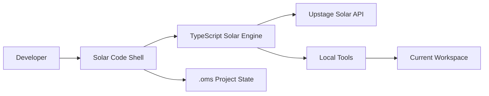

<div align="center">

# Solar Code

**Solar-native terminal coding agent for local repositories.**

Solar Code is an interactive coding agent shell powered by Upstage Solar.  
It can inspect your repository, plan code changes, edit files, run commands, and keep project-local session history.

<br />

```bash
npm install -g solar-code
export UPSTAGE_API_KEY="up_..."
solar
```

<br />

<a href="https://www.npmjs.com/package/solar-code">
  
</a>


</div>

---

## Overview

**Solar Code** is a local terminal coding agent designed for real repository work.

It is closer to **Claude Code** or **Codex CLI** than a collection of standalone commands.  
You launch it inside a project, talk to Solar through an interactive shell, and approve file or command actions as needed.

```text
solar
› ask Solar Code for code work
• Thinking
• Plan write_file src/example.ts
• Modified
  Write src/example.ts
  ? approve? y yes · n no · enter deny
solar › done
```

The legacy `oms` command remains available as a compatibility alias, but the primary product is now:

```text
Solar Code
```

---

## Why Solar Code?

Solar Code is built around a simple idea:

> A coding agent should feel like a native terminal tool, not a detached chatbot.

It provides:

- Interactive agent shell
- Local repository awareness
- Solar function-calling engine
- Workspace-scoped file tools
- Safe approval flow for writes and commands
- Persistent project state under `.oms/`
- Compatibility with existing `oms` workflows

---

## Installation

```bash
npm install -g solar-code
```

Set your Upstage API key:

```bash
export UPSTAGE_API_KEY="up_..."
```

Optional custom base URL:

```bash
export UPSTAGE_BASE_URL="https://..."
```

Launch Solar Code:

```bash
solar
```

---

## Quick Start

Move into a repository:

```bash
cd /path/to/project
solar
```

Then ask Solar Code to work on your codebase:

```text
› Refactor the authentication module and add tests
```

Example session:

```text
› Implement a Tetris game in test/tetris.html

  solar-pro3 ask · /mnt/d/DEV/OhMySolar
• Thinking (2s • esc to interrupt)
• Plan write_file test/tetris.html
• Modified
  Write test/tetris.html
  ok
• Next read tool result and continue
solar › Created test/tetris.html.
```

---

## Terminal UX

Solar Code separates user input, status, work logs, and final responses.

```text
› Implement login validation

  solar-pro3 ask · /mnt/d/DEV/app
• Thinking (2s • esc to interrupt)
• Explored
  Read src/auth.ts
  Grep "validateLogin"
• Plan edit_file src/auth.ts
• Modified
  Edit src/auth.ts
  ok
solar › Updated login validation.
```

| Surface | Behavior |
| --- | --- |
| User input | Dark input card with `›` prompt |
| Status line | Shows active model, permission mode, and current workspace |
| Work log | `Thinking`, `Plan`, `Explored`, `Modified`, `Ran`, `Next` |
| Approval | Single-key approval: <kbd>y</kbd> approve, <kbd>n</kbd> / <kbd>Enter</kbd> / <kbd>Esc</kbd> deny |
| Interrupt | Press <kbd>Esc</kbd> or <kbd>Ctrl+C</kbd> while thinking |
| Markdown emphasis | `**important**` renders as purple terminal emphasis |

---

## Shell Commands

Inside the interactive shell, use slash commands:

| Command | Description |
| --- | --- |
| `/help` | Show available shell commands |
| `/status` | Show session, model, mode, and connection status |
| `/model [model]` | Show or change model usage |
| `/init` | Create `SOLAR.md` project guidance |
| `/history` | Show recent activity |
| `/clear` | Redraw the dashboard |
| `/doctor` | Run environment checks |
| `/setup` | Initialize `.oms/` project state |
| `/agents` | List or show agent profiles |
| `/oms <command>` | Run legacy `oms` commands inside the shell |

Examples:

```text
/doctor
/setup
/init
/history
/oms parse ./report.pdf --ask "핵심 내용을 요약해줘"
/oms team 3 "인증 모듈 리팩토링"
```

---

## CLI Entry Points

| Command | Description |
| --- | --- |
| `solar` | Launch the interactive agent shell |
| `solar "prompt"` | Run a one-shot prompt in the current workspace |
| `solar --yes` | Auto-approve write and execute tool calls |
| `solar --readonly` | Block write and execute tool calls |
| `solar --model solar-pro3` | Override the default model |
| `solar resume` | Resume the last session |

Examples:

```bash
solar
solar "add unit tests for the parser"
solar --yes "format this project and fix lint errors"
solar --readonly "review this codebase for risky patterns"
solar --model solar-pro3
solar resume
```

Legacy commands still work:

```bash
solar setup
solar doctor
solar parse ./report.pdf --ask "요약해줘"
solar team 3 "결제 모듈을 리팩토링해줘"

oms doctor
```

---

## Workspace Boundaries

Solar Code tools are scoped to the directory where `solar` was launched.

For example, if Solar Code starts from:

```text
/mnt/d/DEV/OhMySolar
```

Then these paths are allowed:

```text
test/tetris.html
/mnt/d/DEV/OhMySolar/test/tetris.html
```

But this path is blocked:

```text
/mnt/d/DEV/test/tetris.html
```

To work in another project, start Solar Code there:

```bash
cd /mnt/d/DEV/test
solar
```

This keeps file reads, writes, edits, and shell commands constrained to the active workspace.

---

## Native Engine

Solar Code uses a TypeScript Solar function-calling engine with local coding tools.



Available tools:

| Tool | Purpose |
| --- | --- |
| `bash` | Run shell commands with timeout and output limits |
| `read_file` | Read workspace files with line numbers |
| `write_file` | Create or overwrite files atomically |
| `edit_file` | Replace exact strings safely |
| `glob` | Find files by pattern |
| `grep` | Search file contents |
| `list_files` | List directories |

---

## Permission Modes

Solar Code supports three permission modes.

| Mode | Behavior |
| --- | --- |
| `ask` | Ask before write or execute tools |
| `auto` | Auto-approve tools with `--yes` |
| `readonly` | Block write and execute tools |

Default mode:

```text
ask
```

Use readonly mode for safe code review:

```bash
solar --readonly "review this repository for architectural issues"
```

Use auto mode for trusted workflows:

```bash
solar --yes "fix formatting and run tests"
```

---

## Project State

Solar Code currently stores project state under `.oms/` for compatibility.

```text
.oms/
  config.json
  sessions/
  state/
  logs/
  plans/
  parsed/
  team/
  agents/
  skills/
```

Session history is saved as JSONL:

```text
.oms/sessions/
```

This allows Solar Code to resume previous sessions and preserve project-local context.

---

## Development

Install dependencies:

```bash
npm install
```

Build the project:

```bash
npm run build
```

Run type checks:

```bash
npm run typecheck
```

Run tests:

```bash
npm test
```

Run lint:

```bash
npm run lint
```

Link locally:

```bash
npm run link:global
solar
```

Recommended QA baseline:

```bash
npm run build
npm run typecheck
npm test
npm run lint
```

---

## Build Order

```text
core -> engine -> agents -> skills -> mcp-server -> cli
```

---

## Test Coverage

The test suite includes:

- Engine tool tests
- Stream parser tests
- Terminal output rendering tests
- Input-card cursor placement tests
- Streamed `**bold**` emphasis rendering tests

---

## Environment Variables

| Variable | Required | Description |
| --- | --- | --- |
| `UPSTAGE_API_KEY` | Yes | Upstage API key |
| `UPSTAGE_BASE_URL` | No | Custom Upstage-compatible API base URL |

Example:

```bash
export UPSTAGE_API_KEY="up_..."
export UPSTAGE_BASE_URL="https://..."
```

Default model:

```text
solar-pro3
```

---

## Compatibility

Solar Code is the primary product.

The old `oms` command remains supported as a compatibility alias:

```bash
oms doctor
oms parse ./report.pdf --ask "요약해줘"
oms team 3 "인증 모듈 리팩토링"
```

Inside the Solar Code shell:

```text
/oms doctor
/oms parse ./report.pdf --ask "핵심 내용을 요약해줘"
/oms team 3 "인증 모듈 리팩토링"
```

---

## License

MIT

---

<div align="center">

**Solar Code**  
Terminal-native coding agent powered by Solar.

</div>
